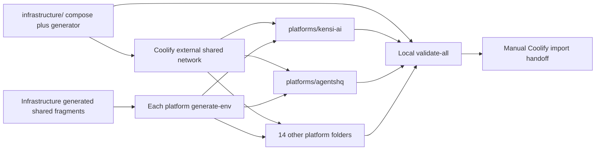

# Plan: Complete Coolify Compose Stack

## Overview

Create the entire production stack as 17 self-contained folders: one infrastructure folder and one folder for each of the 16 platforms. Every folder contains compose.yaml and generate-env.sh. The repository validates and documents the artifacts but performs no deployment.

## Scope Challenge

- Mode: EXPANSION
- Default review: codex
- Delivery: compose artifacts only
- Environment: production only
- Decision: The scope is the complete stack, not a deployment system: 17 Compose files, 17 environment generators, one static validator, and Coolify handoff documentation.

## Prerequisites

- REPOSITORIES.md remains the authoritative 16-platform/domain inventory.
- SHARED_INFRASTRUCTURE.md remains the authoritative shared-service, consumer, database-engine, and isolation map.
- The implementation agent must inspect the pinned repository or recipe evidence before writing each platform process command or image reference.
- Docker Compose v2, shellcheck, openssl, and standard POSIX tools are available for local validation.

## Non-Goals

- No Coolify API calls, UI automation, server mutation, DNS change, resource creation, or deployment execution.
- No custom Python deployment control plane, provider framework, CI rollout system, branch-protection work, or repository source PRs.
- No application-data migration, legacy-volume reuse, database-engine conversion, or production cutover.
- No staging environment and no duplicate shared backing services inside platform Compose files.

## Contracts

- Folder contract: infrastructure/compose.yaml plus infrastructure/generate-env.sh, and platforms/<slug>/compose.yaml plus platforms/<slug>/generate-env.sh for all 16 slugs.
- The infrastructure generator creates shared service credentials and matching per-platform shared-env fragments; each platform generator consumes only its own fragment and produces its local .env.
- Every generator refuses overwrite without --force, creates mode-0600 files, uses cryptographic randomness, prints no secrets, and is safe to rerun.
- Platform Compose files use the Coolify external shared network and environment-provided shared endpoints; depends_on is limited to services in the same file.
- Existing public images use explicit versions where available; otherwise Coolify builds from the declared source repository. Application services have health checks where supported, required variables fail closed, and no shared backing port is publicly published.

## Existing Code Leverage

- REPOSITORIES.md supplies all platform names, component groupings, and domains.
- SHARED_INFRASTRUCTURE.md supplies all shared-service consumers and isolation decisions.
- N8N_CURRENT_RECIPE.md and TWENTY_CURRENT_RECIPE.md supply their complete current multi-process Compose baselines.
- Immutable source-tree evidence already captured for the first-party and third-party repositories supplies real Dockerfiles, commands, health routes, and environment names.

## Shared Infrastructure Map

Coolify deploys these artifacts later but is not part of the Compose stack.

| Component | Responsibility |
| --- | --- |
| Coolify and Traefik | External deployment, private networking, domains, and TLS; untouched by this implementation plan. |
| MySQL 8.4 LTS | Fresh databases and users for MySQL platforms |
| PostgreSQL 16 | Fresh databases and roles for PostgreSQL platforms and Temporal persistence |
| Valkey 8 | Plane cache and future verified Valkey consumers |
| Redis 7.2 cache | Disposable caches, sessions, limits, and locks for Redis-bound applications |
| Redis 7.2 queue | Durable Redis queues with AOF everysec and noeviction |
| MinIO | Shared bucket-isolated object storage |
| Qdrant | Shared collection-isolated vector storage |
| RabbitMQ | Shared vhost-isolated AMQP messaging |
| Elasticsearch | Shared index/role-isolated search and Temporal visibility |
| Temporal | Shared namespace/task-queue-isolated durable workflows |
| Mailpit | Private capture-only SMTP with no relay |
| Monitoring | A pinned resource-bounded monitoring and alerting implementation selected in the Compose task |
| Backup | A pinned off-server backup implementation selected in the Compose task |

## Architecture and Data Flow



| Component | Tasks |
| --- | --- |
| shared-infrastructure-folder | TASK-001 |
| sixteen-platform-folders | TASK-002, TASK-003, TASK-004, TASK-005, TASK-006, TASK-007, TASK-008, TASK-009, TASK-010, TASK-011, TASK-012, TASK-013, TASK-014, TASK-015, TASK-016, TASK-017 |
| static-validation-and-handoff | TASK-018, TASK-019 |

## Tasks

### TASK-001: Create the complete shared infrastructure Compose stack

Create the single infrastructure folder containing the complete reusable backing-service stack and the generator that produces infrastructure plus per-platform shared credentials. Coolify will deploy this Compose later; this task performs no deployment.

**Phase:** shared-infrastructure
**Type:** infra
**Effort:** XL
**Agent:** devops-docker-senior-engineer
**Priority:** P0
**Review:** codex
**Depends on:** None

**Acceptance Criteria:**

- infrastructure/compose.yaml defines pinned, health-checked, resource-bounded MySQL 8.4, PostgreSQL 16, Valkey 8, Redis 7.2 cache, Redis 7.2 queue, MinIO, Qdrant, RabbitMQ, Elasticsearch, Temporal, Mailpit, monitoring, off-server backup, and idempotent bootstrap containers for all required tenant resources.
- No backing-service, administration, database, queue, search, vector, object-console, or Mailpit SMTP port is publicly published; durable services have named volumes and every application receives its native isolation boundary.
- infrastructure/generate-env.sh supports --output-dir <dir> [--force], creates a mode-0600 infrastructure env plus exactly 16 mode-0600 platform shared-env fragments, uses cryptographic random secrets, prints no secret values, and refuses to overwrite existing output without --force.

**Write Scope:**

- `infrastructure/compose.yaml`
- `infrastructure/generate-env.sh`

**Validate Command:**

```bash
shellcheck infrastructure/generate-env.sh && tmp_dir=$(mktemp -d) && infrastructure/generate-env.sh --output-dir "$tmp_dir" && test "$(find "$tmp_dir/platforms" -type f -name '*.shared.env' | wc -l | tr -d ' ')" = 16 && docker compose --env-file "$tmp_dir/infrastructure.env" -f infrastructure/compose.yaml config >/dev/null
```

### TASK-002: Create the Kensi AI platform stack

Create one production Compose file for Kensi AI, combining ulpi-io/kensi-ai-api and ulpi-io/kensi-ai-web into one logical Coolify platform stack. It contains API, web, worker, and scheduler and connects to MySQL 8.4, durable Redis, optional MinIO, and Mailpit through the shared external network without embedding duplicate backing services.

**Phase:** platform-stacks
**Type:** infra
**Effort:** M
**Agent:** devops-docker-senior-engineer
**Priority:** P1
**Review:** codex
**Depends on:** TASK-001

**Acceptance Criteria:**

- platforms/kensi-ai/compose.yaml contains the verified API, web, worker, and scheduler, targets https://kensi.ai, and references MySQL 8.4, durable Redis, optional MinIO, and Mailpit.
- The Compose file declares the Coolify external shared network, contains no cross-stack depends_on entry, contains no duplicate MySQL/PostgreSQL/Valkey/MinIO/Qdrant/RabbitMQ/Elasticsearch/Temporal/Mailpit service, and fails configuration when a required variable is absent.
- platforms/kensi-ai/generate-env.sh supports --shared-env <path> --output <path> [--force], validates the matching kensi-ai shared fragment, writes a mode-0600 platform .env with generated application secrets and the canonical domain, prints no secrets, and refuses overwrite without --force.

**Write Scope:**

- `platforms/kensi-ai/compose.yaml`
- `platforms/kensi-ai/generate-env.sh`

**Validate Command:**

```bash
shellcheck platforms/kensi-ai/generate-env.sh && tmp_dir=$(mktemp -d) && infrastructure/generate-env.sh --output-dir "$tmp_dir" && platforms/kensi-ai/generate-env.sh --shared-env "$tmp_dir/platforms/kensi-ai.shared.env" --output "$tmp_dir/kensi-ai.env" && docker compose --env-file "$tmp_dir/kensi-ai.env" -f platforms/kensi-ai/compose.yaml config >/dev/null
```

### TASK-003: Create the AgentsHQ platform stack

Create one production Compose file for AgentsHQ, combining ulpi-io/agentshq-api and ulpi-io/agentshq-web into one logical Coolify platform stack. It contains API and web and connects to MySQL 8.4 through the shared external network without embedding duplicate backing services.

**Phase:** platform-stacks
**Type:** infra
**Effort:** M
**Agent:** devops-docker-senior-engineer
**Priority:** P1
**Review:** codex
**Depends on:** TASK-001

**Acceptance Criteria:**

- platforms/agentshq/compose.yaml contains the verified API and web, uses its source repository or an existing published image, targets https://www.agentshq.sh/, and references only the required shared endpoints: MySQL 8.4.
- The Compose file declares the Coolify external shared network, contains no cross-stack depends_on entry, contains no duplicate MySQL/PostgreSQL/Valkey/MinIO/Qdrant/RabbitMQ/Elasticsearch/Temporal/Mailpit service, and fails configuration when a required variable is absent.
- platforms/agentshq/generate-env.sh supports --shared-env <path> --output <path> [--force], validates the matching agentshq shared fragment, writes a mode-0600 platform .env with generated application secrets and the canonical domain, prints no secrets, and refuses overwrite without --force.

**Write Scope:**

- `platforms/agentshq/compose.yaml`
- `platforms/agentshq/generate-env.sh`

**Validate Command:**

```bash
shellcheck platforms/agentshq/generate-env.sh && tmp_dir=$(mktemp -d) && infrastructure/generate-env.sh --output-dir "$tmp_dir" && platforms/agentshq/generate-env.sh --shared-env "$tmp_dir/platforms/agentshq.shared.env" --output "$tmp_dir/agentshq.env" && docker compose --env-file "$tmp_dir/agentshq.env" -f platforms/agentshq/compose.yaml config >/dev/null
```

### TASK-004: Create the OpenKudos / TeamToast platform stack

Create one production Compose file for OpenKudos / TeamToast, combining ulpi-io/open-kudos-api and ulpi-io/open-kudos-web into one logical Coolify platform stack. It contains API, web, worker, and scheduler and connects to MySQL 8.4, durable Redis, and Mailpit through the shared external network without embedding duplicate backing services.

**Phase:** platform-stacks
**Type:** infra
**Effort:** M
**Agent:** devops-docker-senior-engineer
**Priority:** P1
**Review:** codex
**Depends on:** TASK-001

**Acceptance Criteria:**

- platforms/open-kudos/compose.yaml contains the verified API, web, worker, and scheduler, targets https://www.teamtoast.ai/, and references MySQL 8.4, durable Redis, and Mailpit.
- The Compose file declares the Coolify external shared network, contains no cross-stack depends_on entry, contains no duplicate MySQL/PostgreSQL/Valkey/MinIO/Qdrant/RabbitMQ/Elasticsearch/Temporal/Mailpit service, and fails configuration when a required variable is absent.
- platforms/open-kudos/generate-env.sh supports --shared-env <path> --output <path> [--force], validates the matching open-kudos shared fragment, writes a mode-0600 platform .env with generated application secrets and the canonical domain, prints no secrets, and refuses overwrite without --force.

**Write Scope:**

- `platforms/open-kudos/compose.yaml`
- `platforms/open-kudos/generate-env.sh`

**Validate Command:**

```bash
shellcheck platforms/open-kudos/generate-env.sh && tmp_dir=$(mktemp -d) && infrastructure/generate-env.sh --output-dir "$tmp_dir" && platforms/open-kudos/generate-env.sh --shared-env "$tmp_dir/platforms/open-kudos.shared.env" --output "$tmp_dir/open-kudos.env" && docker compose --env-file "$tmp_dir/open-kudos.env" -f platforms/open-kudos/compose.yaml config >/dev/null
```

### TASK-005: Create the Insight / Clavinci platform stack

Create one production Compose file for Insight / Clavinci, combining ulpi-io/insight into one logical Coolify platform stack. It contains API and dashboard and connects to MySQL 8.4 through the shared external network without embedding duplicate backing services.

**Phase:** platform-stacks
**Type:** infra
**Effort:** M
**Agent:** devops-docker-senior-engineer
**Priority:** P1
**Review:** codex
**Depends on:** TASK-001

**Acceptance Criteria:**

- platforms/insight/compose.yaml contains the verified API and dashboard, uses its source repository or an existing published image, targets https://clavinci.com, and references only the required shared endpoints: MySQL 8.4.
- The Compose file declares the Coolify external shared network, contains no cross-stack depends_on entry, contains no duplicate MySQL/PostgreSQL/Valkey/MinIO/Qdrant/RabbitMQ/Elasticsearch/Temporal/Mailpit service, and fails configuration when a required variable is absent.
- platforms/insight/generate-env.sh supports --shared-env <path> --output <path> [--force], validates the matching insight shared fragment, writes a mode-0600 platform .env with generated application secrets and the canonical domain, prints no secrets, and refuses overwrite without --force.

**Write Scope:**

- `platforms/insight/compose.yaml`
- `platforms/insight/generate-env.sh`

**Validate Command:**

```bash
shellcheck platforms/insight/generate-env.sh && tmp_dir=$(mktemp -d) && infrastructure/generate-env.sh --output-dir "$tmp_dir" && platforms/insight/generate-env.sh --shared-env "$tmp_dir/platforms/insight.shared.env" --output "$tmp_dir/insight.env" && docker compose --env-file "$tmp_dir/insight.env" -f platforms/insight/compose.yaml config >/dev/null
```

### TASK-006: Create the Togglebox platform stack

Create one production Compose file for Togglebox, combining ulpi-io/togglebox into one logical Coolify platform stack. It contains MySQL-compatible API and admin and connects to MySQL 8.4; DynamoDB is forbidden through the shared external network without embedding duplicate backing services.

**Phase:** platform-stacks
**Type:** infra
**Effort:** M
**Agent:** devops-docker-senior-engineer
**Priority:** P1
**Review:** codex
**Depends on:** TASK-001

**Acceptance Criteria:**

- platforms/togglebox/compose.yaml contains the verified MySQL-compatible API and admin, uses its source repository or an existing published image, targets https://togglebox.dev, and references only the required shared endpoints: MySQL 8.4; DynamoDB is forbidden.
- The Compose file declares the Coolify external shared network, contains no cross-stack depends_on entry, contains no duplicate MySQL/PostgreSQL/Valkey/MinIO/Qdrant/RabbitMQ/Elasticsearch/Temporal/Mailpit service, and fails configuration when a required variable is absent.
- platforms/togglebox/generate-env.sh supports --shared-env <path> --output <path> [--force], validates the matching togglebox shared fragment, writes a mode-0600 platform .env with generated application secrets and the canonical domain, prints no secrets, and refuses overwrite without --force.

**Write Scope:**

- `platforms/togglebox/compose.yaml`
- `platforms/togglebox/generate-env.sh`

**Validate Command:**

```bash
shellcheck platforms/togglebox/generate-env.sh && tmp_dir=$(mktemp -d) && infrastructure/generate-env.sh --output-dir "$tmp_dir" && platforms/togglebox/generate-env.sh --shared-env "$tmp_dir/platforms/togglebox.shared.env" --output "$tmp_dir/togglebox.env" && docker compose --env-file "$tmp_dir/togglebox.env" -f platforms/togglebox/compose.yaml config >/dev/null
```

### TASK-007: Create the OpenPay platform stack

Create one production Compose file for OpenPay, combining CiprianSpiridon/OpenPayApi and CiprianSpiridon/OpenPayWeb into one logical Coolify platform stack. It contains API, web, worker/Horizon when enabled, and scheduler and connects to MySQL 8.4, database-backed cache/queues by default, optional MinIO, and Mailpit.

**Phase:** platform-stacks
**Type:** infra
**Effort:** M
**Agent:** devops-docker-senior-engineer
**Priority:** P1
**Review:** codex
**Depends on:** TASK-001

**Acceptance Criteria:**

- platforms/openpay/compose.yaml contains the API, web, Horizon, and scheduler, targets https://www.openpay.fyi/, and references MySQL 8.4, optional MinIO, and Mailpit.
- The Compose file declares the Coolify external shared network, contains no cross-stack depends_on entry, contains no duplicate MySQL/PostgreSQL/Valkey/MinIO/Qdrant/RabbitMQ/Elasticsearch/Temporal/Mailpit service, and fails configuration when a required variable is absent.
- platforms/openpay/generate-env.sh supports --shared-env <path> --output <path> [--force], validates the matching openpay shared fragment, writes a mode-0600 platform .env with generated application secrets and the canonical domain, prints no secrets, and refuses overwrite without --force.

**Write Scope:**

- `platforms/openpay/compose.yaml`
- `platforms/openpay/generate-env.sh`

**Validate Command:**

```bash
shellcheck platforms/openpay/generate-env.sh && tmp_dir=$(mktemp -d) && infrastructure/generate-env.sh --output-dir "$tmp_dir" && platforms/openpay/generate-env.sh --shared-env "$tmp_dir/platforms/openpay.shared.env" --output "$tmp_dir/openpay.env" && docker compose --env-file "$tmp_dir/openpay.env" -f platforms/openpay/compose.yaml config >/dev/null
```

### TASK-008: Create the Ploon platform stack

Create one production Compose file for Ploon, combining ulpi-io/ploon-web into one logical Coolify platform stack. It contains stateless web and connects to No stateful shared dependency unless source evidence proves an API requirement through the shared external network without embedding duplicate backing services.

**Phase:** platform-stacks
**Type:** infra
**Effort:** M
**Agent:** devops-docker-senior-engineer
**Priority:** P1
**Review:** codex
**Depends on:** TASK-001

**Acceptance Criteria:**

- platforms/ploon/compose.yaml contains the verified stateless web, uses its source repository or an existing published image, targets https://ploon.ai, and references only the required shared endpoints: No stateful shared dependency unless source evidence proves an API requirement.
- The Compose file declares the Coolify external shared network, contains no cross-stack depends_on entry, contains no duplicate MySQL/PostgreSQL/Valkey/MinIO/Qdrant/RabbitMQ/Elasticsearch/Temporal/Mailpit service, and fails configuration when a required variable is absent.
- platforms/ploon/generate-env.sh supports --shared-env <path> --output <path> [--force], validates the matching ploon shared fragment, writes a mode-0600 platform .env with generated application secrets and the canonical domain, prints no secrets, and refuses overwrite without --force.

**Write Scope:**

- `platforms/ploon/compose.yaml`
- `platforms/ploon/generate-env.sh`

**Validate Command:**

```bash
shellcheck platforms/ploon/generate-env.sh && tmp_dir=$(mktemp -d) && infrastructure/generate-env.sh --output-dir "$tmp_dir" && platforms/ploon/generate-env.sh --shared-env "$tmp_dir/platforms/ploon.shared.env" --output "$tmp_dir/ploon.env" && docker compose --env-file "$tmp_dir/ploon.env" -f platforms/ploon/compose.yaml config >/dev/null
```

### TASK-009: Create the Open Growth Group website platform stack

Create one production Compose file for Open Growth Group website, combining CiprianSpiridon/open-growth-group-website into one logical Coolify platform stack. It contains stateless website and connects to No stateful shared dependency through the shared external network without embedding duplicate backing services.

**Phase:** platform-stacks
**Type:** infra
**Effort:** M
**Agent:** devops-docker-senior-engineer
**Priority:** P1
**Review:** codex
**Depends on:** TASK-001

**Acceptance Criteria:**

- platforms/open-growth-group/compose.yaml contains the verified stateless website, uses its source repository or an existing published image, targets https://opengrowthgroup.co, and references only the required shared endpoints: No stateful shared dependency.
- The Compose file declares the Coolify external shared network, contains no cross-stack depends_on entry, contains no duplicate MySQL/PostgreSQL/Valkey/MinIO/Qdrant/RabbitMQ/Elasticsearch/Temporal/Mailpit service, and fails configuration when a required variable is absent.
- platforms/open-growth-group/generate-env.sh supports --shared-env <path> --output <path> [--force], validates the matching open-growth-group shared fragment, writes a mode-0600 platform .env with generated application secrets and the canonical domain, prints no secrets, and refuses overwrite without --force.

**Write Scope:**

- `platforms/open-growth-group/compose.yaml`
- `platforms/open-growth-group/generate-env.sh`

**Validate Command:**

```bash
shellcheck platforms/open-growth-group/generate-env.sh && tmp_dir=$(mktemp -d) && infrastructure/generate-env.sh --output-dir "$tmp_dir" && platforms/open-growth-group/generate-env.sh --shared-env "$tmp_dir/platforms/open-growth-group.shared.env" --output "$tmp_dir/open-growth-group.env" && docker compose --env-file "$tmp_dir/open-growth-group.env" -f platforms/open-growth-group/compose.yaml config >/dev/null
```

### TASK-010: Create the Lokei platform stack

Create one production Compose file for Lokei, combining ulpi-io/lokei into one logical Coolify platform stack. It contains web/API, relay, Horizon worker, and scheduler and connects to MySQL 8.4 and durable Redis through the shared external network without embedding duplicate backing services.

**Phase:** platform-stacks
**Type:** infra
**Effort:** M
**Agent:** devops-docker-senior-engineer
**Priority:** P1
**Review:** codex
**Depends on:** TASK-001

**Acceptance Criteria:**

- platforms/lokei/compose.yaml contains the verified web/API, relay, Horizon worker, and scheduler, targets https://lokei.dev, and references MySQL 8.4 and durable Redis.
- The Compose file declares the Coolify external shared network, contains no cross-stack depends_on entry, contains no duplicate MySQL/PostgreSQL/Valkey/MinIO/Qdrant/RabbitMQ/Elasticsearch/Temporal/Mailpit service, and fails configuration when a required variable is absent.
- platforms/lokei/generate-env.sh supports --shared-env <path> --output <path> [--force], validates the matching lokei shared fragment, writes a mode-0600 platform .env with generated application secrets and the canonical domain, prints no secrets, and refuses overwrite without --force.

**Write Scope:**

- `platforms/lokei/compose.yaml`
- `platforms/lokei/generate-env.sh`

**Validate Command:**

```bash
shellcheck platforms/lokei/generate-env.sh && tmp_dir=$(mktemp -d) && infrastructure/generate-env.sh --output-dir "$tmp_dir" && platforms/lokei/generate-env.sh --shared-env "$tmp_dir/platforms/lokei.shared.env" --output "$tmp_dir/lokei.env" && docker compose --env-file "$tmp_dir/lokei.env" -f platforms/lokei/compose.yaml config >/dev/null
```

### TASK-011: Create the Albert platform stack

Create one production Compose file for Albert, combining ulpi-io/albert into one logical Coolify platform stack. It contains API, web, Horizon worker, scheduler, and Reverb and connects to MySQL 8.4, durable Redis, and Qdrant through the shared external network without embedding duplicate backing services.

**Phase:** platform-stacks
**Type:** infra
**Effort:** M
**Agent:** devops-docker-senior-engineer
**Priority:** P1
**Review:** codex
**Depends on:** TASK-001

**Acceptance Criteria:**

- platforms/albert/compose.yaml contains the verified API, web, Horizon worker, scheduler, and Reverb, targets https://albert.con.fyi, and references MySQL 8.4, durable Redis, and Qdrant.
- The Compose file declares the Coolify external shared network, contains no cross-stack depends_on entry, contains no duplicate MySQL/PostgreSQL/Valkey/MinIO/Qdrant/RabbitMQ/Elasticsearch/Temporal/Mailpit service, and fails configuration when a required variable is absent.
- platforms/albert/generate-env.sh supports --shared-env <path> --output <path> [--force], validates the matching albert shared fragment, writes a mode-0600 platform .env with generated application secrets and the canonical domain, prints no secrets, and refuses overwrite without --force.

**Write Scope:**

- `platforms/albert/compose.yaml`
- `platforms/albert/generate-env.sh`

**Validate Command:**

```bash
shellcheck platforms/albert/generate-env.sh && tmp_dir=$(mktemp -d) && infrastructure/generate-env.sh --output-dir "$tmp_dir" && platforms/albert/generate-env.sh --shared-env "$tmp_dir/platforms/albert.shared.env" --output "$tmp_dir/albert.env" && docker compose --env-file "$tmp_dir/albert.env" -f platforms/albert/compose.yaml config >/dev/null
```

### TASK-012: Create the Record Cloud platform stack

Create one production Compose file for Record Cloud, combining ulpi-io/record-cloud into one logical Coolify platform stack. It contains API and web and connects to MySQL 8.4, MinIO, and Mailpit through the shared external network without embedding duplicate backing services.

**Phase:** platform-stacks
**Type:** infra
**Effort:** M
**Agent:** devops-docker-senior-engineer
**Priority:** P1
**Review:** codex
**Depends on:** TASK-001

**Acceptance Criteria:**

- platforms/record-cloud/compose.yaml contains the verified API and web, uses its source repository or an existing published image, targets https://record.con.fyi, and references only the required shared endpoints: MySQL 8.4, MinIO, and Mailpit.
- The Compose file declares the Coolify external shared network, contains no cross-stack depends_on entry, contains no duplicate MySQL/PostgreSQL/Valkey/MinIO/Qdrant/RabbitMQ/Elasticsearch/Temporal/Mailpit service, and fails configuration when a required variable is absent.
- platforms/record-cloud/generate-env.sh supports --shared-env <path> --output <path> [--force], validates the matching record-cloud shared fragment, writes a mode-0600 platform .env with generated application secrets and the canonical domain, prints no secrets, and refuses overwrite without --force.

**Write Scope:**

- `platforms/record-cloud/compose.yaml`
- `platforms/record-cloud/generate-env.sh`

**Validate Command:**

```bash
shellcheck platforms/record-cloud/generate-env.sh && tmp_dir=$(mktemp -d) && infrastructure/generate-env.sh --output-dir "$tmp_dir" && platforms/record-cloud/generate-env.sh --shared-env "$tmp_dir/platforms/record-cloud.shared.env" --output "$tmp_dir/record-cloud.env" && docker compose --env-file "$tmp_dir/record-cloud.env" -f platforms/record-cloud/compose.yaml config >/dev/null
```

### TASK-013: Create the Plane platform stack

Create one production Compose file for Plane, combining makeplane/plane into one logical Coolify platform stack. It contains pinned Plane application services and connects to PostgreSQL 16, cache Valkey, RabbitMQ, and MinIO through the shared external network without embedding duplicate backing services.

**Phase:** platform-stacks
**Type:** infra
**Effort:** L
**Agent:** devops-docker-senior-engineer
**Priority:** P1
**Review:** codex
**Depends on:** TASK-001

**Acceptance Criteria:**

- platforms/plane/compose.yaml contains the verified pinned Plane application services, uses its source repository or an existing published image, targets https://pm.con.fyi, and references only the required shared endpoints: PostgreSQL 16, cache Valkey, RabbitMQ, and MinIO.
- The Compose file declares the Coolify external shared network, contains no cross-stack depends_on entry, contains no duplicate MySQL/PostgreSQL/Valkey/MinIO/Qdrant/RabbitMQ/Elasticsearch/Temporal/Mailpit service, and fails configuration when a required variable is absent.
- platforms/plane/generate-env.sh supports --shared-env <path> --output <path> [--force], validates the matching plane shared fragment, writes a mode-0600 platform .env with generated application secrets and the canonical domain, prints no secrets, and refuses overwrite without --force.

**Write Scope:**

- `platforms/plane/compose.yaml`
- `platforms/plane/generate-env.sh`

**Validate Command:**

```bash
shellcheck platforms/plane/generate-env.sh && tmp_dir=$(mktemp -d) && infrastructure/generate-env.sh --output-dir "$tmp_dir" && platforms/plane/generate-env.sh --shared-env "$tmp_dir/platforms/plane.shared.env" --output "$tmp_dir/plane.env" && docker compose --env-file "$tmp_dir/plane.env" -f platforms/plane/compose.yaml config >/dev/null
```

### TASK-014: Create the Postiz platform stack

Create one production Compose file for Postiz, combining ulpi-io/postiz-docker-compose into one logical Coolify platform stack. It connects to PostgreSQL 16, durable Redis, Temporal, Elasticsearch, and its uploads storage contract through the shared external network.

**Phase:** platform-stacks
**Type:** infra
**Effort:** L
**Agent:** devops-docker-senior-engineer
**Priority:** P1
**Review:** codex
**Depends on:** TASK-001

**Acceptance Criteria:**

- platforms/postiz/compose.yaml targets https://post.con.fyi and references PostgreSQL 16, durable Redis, Temporal, Elasticsearch, and its uploads storage contract.
- The Compose file declares the Coolify external shared network, contains no cross-stack depends_on entry, contains no duplicate MySQL/PostgreSQL/Valkey/MinIO/Qdrant/RabbitMQ/Elasticsearch/Temporal/Mailpit service, and fails configuration when a required variable is absent.
- platforms/postiz/generate-env.sh supports --shared-env <path> --output <path> [--force], validates the matching postiz shared fragment, writes a mode-0600 platform .env with generated application secrets and the canonical domain, prints no secrets, and refuses overwrite without --force.

**Write Scope:**

- `platforms/postiz/compose.yaml`
- `platforms/postiz/generate-env.sh`

**Validate Command:**

```bash
shellcheck platforms/postiz/generate-env.sh && tmp_dir=$(mktemp -d) && infrastructure/generate-env.sh --output-dir "$tmp_dir" && platforms/postiz/generate-env.sh --shared-env "$tmp_dir/platforms/postiz.shared.env" --output "$tmp_dir/postiz.env" && docker compose --env-file "$tmp_dir/postiz.env" -f platforms/postiz/compose.yaml config >/dev/null
```

### TASK-015: Create the Nudgra OSS platform stack

Create one production Compose file for Nudgra OSS, combining MaikoCode/nudgra-oss into one logical Coolify platform stack. It contains pinned Nudgra application services and connects to PostgreSQL 16 with pgcrypto and pg-boss through the shared external network without embedding duplicate backing services.

**Phase:** platform-stacks
**Type:** infra
**Effort:** M
**Agent:** devops-docker-senior-engineer
**Priority:** P1
**Review:** codex
**Depends on:** TASK-001

**Acceptance Criteria:**

- platforms/nudgra-oss/compose.yaml contains the verified pinned Nudgra application services, uses its source repository or an existing published image, targets https://ig.con.fyi, and references only the required shared endpoints: PostgreSQL 16 with pgcrypto and pg-boss.
- The Compose file declares the Coolify external shared network, contains no cross-stack depends_on entry, contains no duplicate MySQL/PostgreSQL/Valkey/MinIO/Qdrant/RabbitMQ/Elasticsearch/Temporal/Mailpit service, and fails configuration when a required variable is absent.
- platforms/nudgra-oss/generate-env.sh supports --shared-env <path> --output <path> [--force], validates the matching nudgra-oss shared fragment, writes a mode-0600 platform .env with generated application secrets and the canonical domain, prints no secrets, and refuses overwrite without --force.

**Write Scope:**

- `platforms/nudgra-oss/compose.yaml`
- `platforms/nudgra-oss/generate-env.sh`

**Validate Command:**

```bash
shellcheck platforms/nudgra-oss/generate-env.sh && tmp_dir=$(mktemp -d) && infrastructure/generate-env.sh --output-dir "$tmp_dir" && platforms/nudgra-oss/generate-env.sh --shared-env "$tmp_dir/platforms/nudgra-oss.shared.env" --output "$tmp_dir/nudgra-oss.env" && docker compose --env-file "$tmp_dir/nudgra-oss.env" -f platforms/nudgra-oss/compose.yaml config >/dev/null
```

### TASK-016: Create the n8n platform stack

Create one production Compose file for n8n, combining N8N_CURRENT_RECIPE.md into one logical Coolify platform stack. It contains n8n main, worker, and task runners using n8nio/n8n:2.10.4-compatible contracts and connects to PostgreSQL 16 and durable Redis.

**Phase:** platform-stacks
**Type:** infra
**Effort:** L
**Agent:** devops-docker-senior-engineer
**Priority:** P1
**Review:** codex
**Depends on:** TASK-001

**Acceptance Criteria:**

- platforms/n8n/compose.yaml contains n8n main, worker, and task runners, targets https://workflow.con.fyi, and references PostgreSQL 16 and durable Redis.
- The Compose file declares the Coolify external shared network, contains no cross-stack depends_on entry, contains no duplicate MySQL/PostgreSQL/Valkey/MinIO/Qdrant/RabbitMQ/Elasticsearch/Temporal/Mailpit service, and fails configuration when a required variable is absent.
- platforms/n8n/generate-env.sh supports --shared-env <path> --output <path> [--force], validates the matching n8n shared fragment, writes a mode-0600 platform .env with generated application secrets and the canonical domain, prints no secrets, and refuses overwrite without --force.

**Write Scope:**

- `platforms/n8n/compose.yaml`
- `platforms/n8n/generate-env.sh`

**Validate Command:**

```bash
shellcheck platforms/n8n/generate-env.sh && tmp_dir=$(mktemp -d) && infrastructure/generate-env.sh --output-dir "$tmp_dir" && platforms/n8n/generate-env.sh --shared-env "$tmp_dir/platforms/n8n.shared.env" --output "$tmp_dir/n8n.env" && docker compose --env-file "$tmp_dir/n8n.env" -f platforms/n8n/compose.yaml config >/dev/null
```

### TASK-017: Create the Twenty platform stack

Create one production Compose file for Twenty, combining TWENTY_CURRENT_RECIPE.md into one logical Coolify platform stack. It contains Twenty app and worker and connects to PostgreSQL 16, Redis cache, pg-boss, optional MinIO, and Mailpit.

**Phase:** platform-stacks
**Type:** infra
**Effort:** L
**Agent:** devops-docker-senior-engineer
**Priority:** P1
**Review:** codex
**Depends on:** TASK-001

**Acceptance Criteria:**

- platforms/twenty/compose.yaml contains the Twenty app and worker, targets https://crm.con.fyi, and references PostgreSQL 16, Redis cache, pg-boss, optional MinIO, and Mailpit.
- The Compose file declares the Coolify external shared network, contains no cross-stack depends_on entry, contains no duplicate MySQL/PostgreSQL/Valkey/MinIO/Qdrant/RabbitMQ/Elasticsearch/Temporal/Mailpit service, and fails configuration when a required variable is absent.
- platforms/twenty/generate-env.sh supports --shared-env <path> --output <path> [--force], validates the matching twenty shared fragment, writes a mode-0600 platform .env with generated application secrets and the canonical domain, prints no secrets, and refuses overwrite without --force.

**Write Scope:**

- `platforms/twenty/compose.yaml`
- `platforms/twenty/generate-env.sh`

**Validate Command:**

```bash
shellcheck platforms/twenty/generate-env.sh && tmp_dir=$(mktemp -d) && infrastructure/generate-env.sh --output-dir "$tmp_dir" && platforms/twenty/generate-env.sh --shared-env "$tmp_dir/platforms/twenty.shared.env" --output "$tmp_dir/twenty.env" && docker compose --env-file "$tmp_dir/twenty.env" -f platforms/twenty/compose.yaml config >/dev/null
```

### TASK-018: Validate the complete 17-folder Compose system

Add one local validator for the infrastructure folder and all 16 platform folders, plus ignore rules preventing generated secrets from entering Git. It performs static validation only and never contacts Coolify or the server.

**Phase:** validation-handoff
**Type:** infra
**Effort:** L
**Agent:** devops-docker-senior-engineer
**Priority:** P1
**Review:** codex
**Depends on:** TASK-002, TASK-003, TASK-004, TASK-005, TASK-006, TASK-007, TASK-008, TASK-009, TASK-010, TASK-011, TASK-012, TASK-013, TASK-014, TASK-015, TASK-016, TASK-017

**Acceptance Criteria:**

- scripts/validate-all.sh discovers exactly one infrastructure Compose/generator pair and exactly 16 platform Compose/generator pairs, generates all environments in a temporary directory, and runs docker compose config on all 17 stacks.
- Validation fails on missing/extra platform folders, latest tags, missing health checks, public backing-service ports, duplicate shared services inside a platform, cross-stack depends_on, unresolved variables, generator overwrite, non-0600 secret files, or secret output.
- .gitignore excludes every generated .env, infrastructure/generated output, temporary validation output, database dump, snapshot, certificate, and recovery credential while leaving generator scripts tracked.

**Write Scope:**

- `scripts/validate-all.sh`
- `.gitignore`

**Validate Command:**

```bash
shellcheck scripts/validate-all.sh infrastructure/generate-env.sh platforms/*/generate-env.sh && scripts/validate-all.sh
```

### TASK-019: Document Coolify import and configuration handoff

Document the exact folder contract, environment-generation workflow, static validation, Coolify import order, domains, shared-network connection, and manual verification steps without executing any deployment.

**Phase:** validation-handoff
**Type:** docs
**Effort:** M
**Agent:** general-purpose
**Priority:** P1
**Review:** codex
**Depends on:** TASK-018

**Acceptance Criteria:**

- README.md lists the infrastructure folder and all 16 platform folders, explains that every folder owns compose.yaml plus generate-env.sh, and shows the one-command local validation workflow.
- COOLIFY_IMPORT.md explains how the user generates each env, imports infrastructure first and each platform separately into Coolify, connects the same external network, assigns the canonical domain, and verifies health without exposing backing ports.
- Documentation explicitly states that repository tooling performs no deployment, DNS mutation, server mutation, database migration, or Coolify API call and never instructs the user to commit generated secrets.

**Write Scope:**

- `README.md`
- `COOLIFY_IMPORT.md`

**Validate Command:**

```bash
rg -q '17' README.md && rg -q 'generate-env.sh' README.md && for slug in ${platforms.map(p => p.slug).join(' ')}; do rg -q "$slug" README.md || exit 1; done && rg -q 'infrastructure first' COOLIFY_IMPORT.md && rg -q 'no deployment|does not deploy' COOLIFY_IMPORT.md
```

## Failure Modes

- Missing or conflicting source evidence blocks only the affected platform Compose task; it is never replaced by a guessed command or image.
- A generator missing its matching shared fragment, required input, openssl, or safe output permissions exits non-zero without creating a partial environment.
- An existing env file is preserved unless --force is explicit; secrets are never printed or committed.
- Any unresolved Compose variable, latest tag, public backing port, duplicate shared service, or cross-stack depends_on fails local validation.
- The repository never interprets successful static validation as a successful deployment.

## Ship Cut

- Milestone 1: The infrastructure folder and all 16 platform folders each contain a statically valid compose.yaml and generate-env.sh.
- Milestone 2: The 17-folder validator passes and the manual Coolify import guide covers every platform and domain without executing deployment.

## Test Coverage Map

| Task | Test type | Validate command |
| --- | --- | --- |
| TASK-001 | folder-scoped Compose and shell validation | `shellcheck infrastructure/generate-env.sh && tmp_dir=$(mktemp -d) && infrastructure/generate-env.sh --output-dir "$tmp_dir" && test "$(find "$tmp_dir/platforms" -type f -name '*.shared.env' \| wc -l \| tr -d ' ')" = 16 && docker compose --env-file "$tmp_dir/infrastructure.env" -f infrastructure/compose.yaml config >/dev/null` |
| TASK-002 | folder-scoped Compose and shell validation | `shellcheck platforms/kensi-ai/generate-env.sh && tmp_dir=$(mktemp -d) && infrastructure/generate-env.sh --output-dir "$tmp_dir" && platforms/kensi-ai/generate-env.sh --shared-env "$tmp_dir/platforms/kensi-ai.shared.env" --output "$tmp_dir/kensi-ai.env" && docker compose --env-file "$tmp_dir/kensi-ai.env" -f platforms/kensi-ai/compose.yaml config >/dev/null` |
| TASK-003 | folder-scoped Compose and shell validation | `shellcheck platforms/agentshq/generate-env.sh && tmp_dir=$(mktemp -d) && infrastructure/generate-env.sh --output-dir "$tmp_dir" && platforms/agentshq/generate-env.sh --shared-env "$tmp_dir/platforms/agentshq.shared.env" --output "$tmp_dir/agentshq.env" && docker compose --env-file "$tmp_dir/agentshq.env" -f platforms/agentshq/compose.yaml config >/dev/null` |
| TASK-004 | folder-scoped Compose and shell validation | `shellcheck platforms/open-kudos/generate-env.sh && tmp_dir=$(mktemp -d) && infrastructure/generate-env.sh --output-dir "$tmp_dir" && platforms/open-kudos/generate-env.sh --shared-env "$tmp_dir/platforms/open-kudos.shared.env" --output "$tmp_dir/open-kudos.env" && docker compose --env-file "$tmp_dir/open-kudos.env" -f platforms/open-kudos/compose.yaml config >/dev/null` |
| TASK-005 | folder-scoped Compose and shell validation | `shellcheck platforms/insight/generate-env.sh && tmp_dir=$(mktemp -d) && infrastructure/generate-env.sh --output-dir "$tmp_dir" && platforms/insight/generate-env.sh --shared-env "$tmp_dir/platforms/insight.shared.env" --output "$tmp_dir/insight.env" && docker compose --env-file "$tmp_dir/insight.env" -f platforms/insight/compose.yaml config >/dev/null` |
| TASK-006 | folder-scoped Compose and shell validation | `shellcheck platforms/togglebox/generate-env.sh && tmp_dir=$(mktemp -d) && infrastructure/generate-env.sh --output-dir "$tmp_dir" && platforms/togglebox/generate-env.sh --shared-env "$tmp_dir/platforms/togglebox.shared.env" --output "$tmp_dir/togglebox.env" && docker compose --env-file "$tmp_dir/togglebox.env" -f platforms/togglebox/compose.yaml config >/dev/null` |
| TASK-007 | folder-scoped Compose and shell validation | `shellcheck platforms/openpay/generate-env.sh && tmp_dir=$(mktemp -d) && infrastructure/generate-env.sh --output-dir "$tmp_dir" && platforms/openpay/generate-env.sh --shared-env "$tmp_dir/platforms/openpay.shared.env" --output "$tmp_dir/openpay.env" && docker compose --env-file "$tmp_dir/openpay.env" -f platforms/openpay/compose.yaml config >/dev/null` |
| TASK-008 | folder-scoped Compose and shell validation | `shellcheck platforms/ploon/generate-env.sh && tmp_dir=$(mktemp -d) && infrastructure/generate-env.sh --output-dir "$tmp_dir" && platforms/ploon/generate-env.sh --shared-env "$tmp_dir/platforms/ploon.shared.env" --output "$tmp_dir/ploon.env" && docker compose --env-file "$tmp_dir/ploon.env" -f platforms/ploon/compose.yaml config >/dev/null` |
| TASK-009 | folder-scoped Compose and shell validation | `shellcheck platforms/open-growth-group/generate-env.sh && tmp_dir=$(mktemp -d) && infrastructure/generate-env.sh --output-dir "$tmp_dir" && platforms/open-growth-group/generate-env.sh --shared-env "$tmp_dir/platforms/open-growth-group.shared.env" --output "$tmp_dir/open-growth-group.env" && docker compose --env-file "$tmp_dir/open-growth-group.env" -f platforms/open-growth-group/compose.yaml config >/dev/null` |
| TASK-010 | folder-scoped Compose and shell validation | `shellcheck platforms/lokei/generate-env.sh && tmp_dir=$(mktemp -d) && infrastructure/generate-env.sh --output-dir "$tmp_dir" && platforms/lokei/generate-env.sh --shared-env "$tmp_dir/platforms/lokei.shared.env" --output "$tmp_dir/lokei.env" && docker compose --env-file "$tmp_dir/lokei.env" -f platforms/lokei/compose.yaml config >/dev/null` |
| TASK-011 | folder-scoped Compose and shell validation | `shellcheck platforms/albert/generate-env.sh && tmp_dir=$(mktemp -d) && infrastructure/generate-env.sh --output-dir "$tmp_dir" && platforms/albert/generate-env.sh --shared-env "$tmp_dir/platforms/albert.shared.env" --output "$tmp_dir/albert.env" && docker compose --env-file "$tmp_dir/albert.env" -f platforms/albert/compose.yaml config >/dev/null` |
| TASK-012 | folder-scoped Compose and shell validation | `shellcheck platforms/record-cloud/generate-env.sh && tmp_dir=$(mktemp -d) && infrastructure/generate-env.sh --output-dir "$tmp_dir" && platforms/record-cloud/generate-env.sh --shared-env "$tmp_dir/platforms/record-cloud.shared.env" --output "$tmp_dir/record-cloud.env" && docker compose --env-file "$tmp_dir/record-cloud.env" -f platforms/record-cloud/compose.yaml config >/dev/null` |
| TASK-013 | folder-scoped Compose and shell validation | `shellcheck platforms/plane/generate-env.sh && tmp_dir=$(mktemp -d) && infrastructure/generate-env.sh --output-dir "$tmp_dir" && platforms/plane/generate-env.sh --shared-env "$tmp_dir/platforms/plane.shared.env" --output "$tmp_dir/plane.env" && docker compose --env-file "$tmp_dir/plane.env" -f platforms/plane/compose.yaml config >/dev/null` |
| TASK-014 | folder-scoped Compose and shell validation | `shellcheck platforms/postiz/generate-env.sh && tmp_dir=$(mktemp -d) && infrastructure/generate-env.sh --output-dir "$tmp_dir" && platforms/postiz/generate-env.sh --shared-env "$tmp_dir/platforms/postiz.shared.env" --output "$tmp_dir/postiz.env" && docker compose --env-file "$tmp_dir/postiz.env" -f platforms/postiz/compose.yaml config >/dev/null` |
| TASK-015 | folder-scoped Compose and shell validation | `shellcheck platforms/nudgra-oss/generate-env.sh && tmp_dir=$(mktemp -d) && infrastructure/generate-env.sh --output-dir "$tmp_dir" && platforms/nudgra-oss/generate-env.sh --shared-env "$tmp_dir/platforms/nudgra-oss.shared.env" --output "$tmp_dir/nudgra-oss.env" && docker compose --env-file "$tmp_dir/nudgra-oss.env" -f platforms/nudgra-oss/compose.yaml config >/dev/null` |
| TASK-016 | folder-scoped Compose and shell validation | `shellcheck platforms/n8n/generate-env.sh && tmp_dir=$(mktemp -d) && infrastructure/generate-env.sh --output-dir "$tmp_dir" && platforms/n8n/generate-env.sh --shared-env "$tmp_dir/platforms/n8n.shared.env" --output "$tmp_dir/n8n.env" && docker compose --env-file "$tmp_dir/n8n.env" -f platforms/n8n/compose.yaml config >/dev/null` |
| TASK-017 | folder-scoped Compose and shell validation | `shellcheck platforms/twenty/generate-env.sh && tmp_dir=$(mktemp -d) && infrastructure/generate-env.sh --output-dir "$tmp_dir" && platforms/twenty/generate-env.sh --shared-env "$tmp_dir/platforms/twenty.shared.env" --output "$tmp_dir/twenty.env" && docker compose --env-file "$tmp_dir/twenty.env" -f platforms/twenty/compose.yaml config >/dev/null` |
| TASK-018 | full static contract | `shellcheck scripts/validate-all.sh infrastructure/generate-env.sh platforms/*/generate-env.sh && scripts/validate-all.sh` |
| TASK-019 | documentation contract | `rg -q '17' README.md && rg -q 'generate-env.sh' README.md && for slug in ${platforms.map(p => p.slug).join(' ')}; do rg -q "$slug" README.md \|\| exit 1; done && rg -q 'infrastructure first' COOLIFY_IMPORT.md && rg -q 'no deployment\|does not deploy' COOLIFY_IMPORT.md` |

## Execution Summary

- Tasks: 19
- Parallel layers: 4
- Critical path (4 tasks): TASK-001 -> TASK-002 -> TASK-018 -> TASK-019

## Task Dependencies

- TASK-001: None
- TASK-002: TASK-001
- TASK-003: TASK-001
- TASK-004: TASK-001
- TASK-005: TASK-001
- TASK-006: TASK-001
- TASK-007: TASK-001
- TASK-008: TASK-001
- TASK-009: TASK-001
- TASK-010: TASK-001
- TASK-011: TASK-001
- TASK-012: TASK-001
- TASK-013: TASK-001
- TASK-014: TASK-001
- TASK-015: TASK-001
- TASK-016: TASK-001
- TASK-017: TASK-001
- TASK-018: TASK-002, TASK-003, TASK-004, TASK-005, TASK-006, TASK-007, TASK-008, TASK-009, TASK-010, TASK-011, TASK-012, TASK-013, TASK-014, TASK-015, TASK-016, TASK-017
- TASK-019: TASK-018
