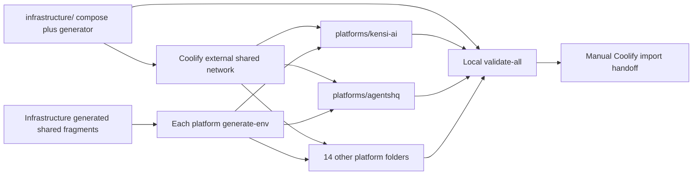

# Plan: Phase 1: Shared Infrastructure Folder

## Overview

The complete shared infrastructure Compose and environment generator pass local validation.

## Scope Challenge

- Mode: EXPANSION
- Default review: codex
- Delivery: compose artifacts only
- Environment: production only
- Decision: The scope is the complete stack, not a deployment system: 17 Compose files, 17 environment generators, one static validator, and Coolify handoff documentation.

## Prerequisites

- REPOSITORIES.md remains the authoritative 16-platform/domain inventory.
- SHARED_INFRASTRUCTURE.md remains the authoritative shared-service, consumer, database-engine, and isolation map.
- The implementation agent must inspect the pinned repository or recipe evidence before writing each platform process command or image reference.
- Docker Compose v2, shellcheck, openssl, and standard POSIX tools are available for local validation.

## Non-Goals

- No Coolify API calls, UI automation, server mutation, DNS change, resource creation, or deployment execution.
- No custom Python deployment control plane, provider framework, CI rollout system, branch-protection work, or repository source PRs.
- No application-data migration, legacy-volume reuse, database-engine conversion, or production cutover.
- No staging environment and no duplicate shared backing services inside platform Compose files.

## Contracts

- Folder contract: infrastructure/compose.yaml plus infrastructure/generate-env.sh, and platforms/<slug>/compose.yaml plus platforms/<slug>/generate-env.sh for all 16 slugs.
- The infrastructure generator creates shared service credentials and matching per-platform shared-env fragments; each platform generator consumes only its own fragment and produces its local .env.
- Every generator refuses overwrite without --force, creates mode-0600 files, uses cryptographic randomness, prints no secrets, and is safe to rerun.
- Platform Compose files use the Coolify external shared network and environment-provided shared endpoints; depends_on is limited to services in the same file.
- All images are immutable or exactly versioned, all application services have health checks where supported, all required variables fail closed, and no shared backing port is publicly published.

## Existing Code Leverage

- REPOSITORIES.md supplies all platform names, component groupings, and domains.
- SHARED_INFRASTRUCTURE.md supplies all shared-service consumers and isolation decisions.
- N8N_CURRENT_RECIPE.md and TWENTY_CURRENT_RECIPE.md supply their complete current multi-process Compose baselines.
- Immutable source-tree evidence already captured for the first-party and third-party repositories supplies real Dockerfiles, commands, health routes, and environment names.

## Shared Infrastructure Map

Coolify deploys these artifacts later but is not part of the Compose stack.

| Component | Responsibility |
| --- | --- |
| Coolify and Traefik | External deployment, private networking, domains, and TLS; untouched by this implementation plan. |
| MySQL 8.4 LTS | Fresh databases and users for MySQL platforms |
| PostgreSQL 16 | Fresh databases and roles for PostgreSQL platforms and Temporal persistence |
| Valkey 8 cache | Disposable caches, sessions, limits, and locks |
| Valkey 8 queue | Durable Redis-compatible queues with AOF everysec and noeviction |
| MinIO | Shared bucket-isolated object storage |
| Qdrant | Shared collection-isolated vector storage |
| RabbitMQ | Shared vhost-isolated AMQP messaging |
| Elasticsearch | Shared index/role-isolated search and Temporal visibility |
| Temporal | Shared namespace/task-queue-isolated durable workflows |
| Mailpit | Private capture-only SMTP with no relay |
| Monitoring | A pinned resource-bounded monitoring and alerting implementation selected in the Compose task |
| Backup | A pinned off-server backup implementation selected in the Compose task |

## Architecture and Data Flow



| Component | Tasks |
| --- | --- |
| shared-infrastructure-folder | TASK-001 |

## Tasks

### TASK-001: Create the complete shared infrastructure Compose stack

Create the single infrastructure folder containing the complete reusable backing-service stack and the generator that produces infrastructure plus per-platform shared credentials. Coolify will deploy this Compose later; this task performs no deployment.

**Phase:** shared-infrastructure
**Type:** infra
**Effort:** XL
**Agent:** devops-docker-senior-engineer
**Priority:** P0
**Review:** codex
**Depends on:** None

**Acceptance Criteria:**

- infrastructure/compose.yaml defines pinned, health-checked, resource-bounded MySQL 8.4, PostgreSQL 16, cache Valkey 8, queue Valkey 8, MinIO, Qdrant, RabbitMQ, Elasticsearch, Temporal, Mailpit, the selected monitoring implementation, the selected off-server backup implementation, and idempotent bootstrap containers for all required tenant resources.
- No backing-service, administration, database, queue, search, vector, object-console, or Mailpit SMTP port is publicly published; durable services have named volumes and every application receives its native isolation boundary.
- infrastructure/generate-env.sh supports --output-dir <dir> [--force], creates a mode-0600 infrastructure env plus exactly 16 mode-0600 platform shared-env fragments, uses cryptographic random secrets, prints no secret values, and refuses to overwrite existing output without --force.

**Write Scope:**

- `infrastructure/compose.yaml`
- `infrastructure/generate-env.sh`

**Validate Command:**

```bash
shellcheck infrastructure/generate-env.sh && tmp_dir=$(mktemp -d) && infrastructure/generate-env.sh --output-dir "$tmp_dir" && test "$(find "$tmp_dir/platforms" -type f -name '*.shared.env' | wc -l | tr -d ' ')" = 16 && docker compose --env-file "$tmp_dir/infrastructure.env" -f infrastructure/compose.yaml config >/dev/null
```

## Failure Modes

- Missing or conflicting source evidence blocks only the affected platform Compose task; it is never replaced by a guessed command or image.
- A generator missing its matching shared fragment, required input, openssl, or safe output permissions exits non-zero without creating a partial environment.
- An existing env file is preserved unless --force is explicit; secrets are never printed or committed.
- Any unresolved Compose variable, latest tag, public backing port, duplicate shared service, or cross-stack depends_on fails local validation.
- The repository never interprets successful static validation as a successful deployment.

## Ship Cut

- Milestone 1: The infrastructure folder and all 16 platform folders each contain a statically valid compose.yaml and generate-env.sh.
- Milestone 2: The 17-folder validator passes and the manual Coolify import guide covers every platform and domain without executing deployment.

## Test Coverage Map

| Task | Test type | Validate command |
| --- | --- | --- |
| TASK-001 | folder-scoped Compose and shell validation | `shellcheck infrastructure/generate-env.sh && tmp_dir=$(mktemp -d) && infrastructure/generate-env.sh --output-dir "$tmp_dir" && test "$(find "$tmp_dir/platforms" -type f -name '*.shared.env' \| wc -l \| tr -d ' ')" = 16 && docker compose --env-file "$tmp_dir/infrastructure.env" -f infrastructure/compose.yaml config >/dev/null` |

## Execution Summary

- Tasks: 1
- Parallel layers: 1
- Critical path (1 tasks): TASK-001

## Task Dependencies

- TASK-001: None
