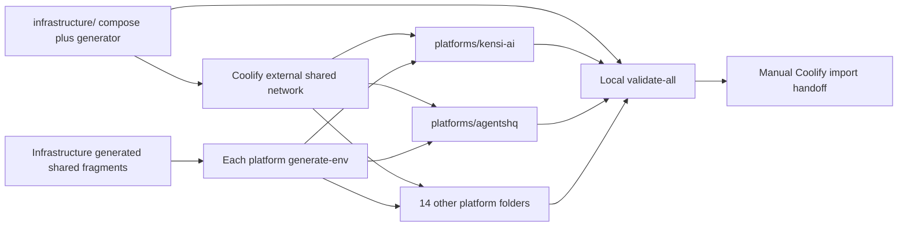

# Plan: Phase 3: Static Validation and Coolify Handoff

## Overview

All 17 folders pass one local validator and the manual import guide is complete.

## Scope Challenge

- Mode: EXPANSION
- Default review: codex
- Delivery: compose artifacts only
- Environment: production only
- Decision: The scope is the complete stack, not a deployment system: 17 Compose files, 17 environment generators, one static validator, and Coolify handoff documentation.

## Prerequisites

- REPOSITORIES.md remains the authoritative 16-platform/domain inventory.
- SHARED_INFRASTRUCTURE.md remains the authoritative shared-service, consumer, database-engine, and isolation map.
- The implementation agent must inspect the pinned repository or recipe evidence before writing each platform process command or image reference.
- Docker Compose v2, shellcheck, openssl, and standard POSIX tools are available for local validation.

## Non-Goals

- No Coolify API calls, UI automation, server mutation, DNS change, resource creation, or deployment execution.
- No custom Python deployment control plane, provider framework, CI rollout system, branch-protection work, or repository source PRs.
- No application-data migration, legacy-volume reuse, database-engine conversion, or production cutover.
- No staging environment and no duplicate shared backing services inside platform Compose files.

## Contracts

- Folder contract: infrastructure/compose.yaml plus infrastructure/generate-env.sh, and platforms/<slug>/compose.yaml plus platforms/<slug>/generate-env.sh for all 16 slugs.
- The infrastructure generator creates shared service credentials and matching per-platform shared-env fragments; each platform generator consumes only its own fragment and produces its local .env.
- Every generator refuses overwrite without --force, creates mode-0600 files, uses cryptographic randomness, prints no secrets, and is safe to rerun.
- Platform Compose files use the Coolify external shared network and environment-provided shared endpoints; depends_on is limited to services in the same file.
- All images are immutable or exactly versioned, all application services have health checks where supported, all required variables fail closed, and no shared backing port is publicly published.

## Existing Code Leverage

- REPOSITORIES.md supplies all platform names, component groupings, and domains.
- SHARED_INFRASTRUCTURE.md supplies all shared-service consumers and isolation decisions.
- N8N_CURRENT_RECIPE.md and TWENTY_CURRENT_RECIPE.md supply their complete current multi-process Compose baselines.
- Immutable source-tree evidence already captured for the first-party and third-party repositories supplies real Dockerfiles, commands, health routes, and environment names.

## Shared Infrastructure Map

Coolify deploys these artifacts later but is not part of the Compose stack.

| Component | Responsibility |
| --- | --- |
| Coolify and Traefik | External deployment, private networking, domains, and TLS; untouched by this implementation plan. |
| MySQL 8.4 LTS | Fresh databases and users for MySQL platforms |
| PostgreSQL 16 | Fresh databases and roles for PostgreSQL platforms and Temporal persistence |
| Valkey 8 cache | Disposable caches, sessions, limits, and locks |
| Valkey 8 queue | Durable Redis-compatible queues with AOF everysec and noeviction |
| MinIO | Shared bucket-isolated object storage |
| Qdrant | Shared collection-isolated vector storage |
| RabbitMQ | Shared vhost-isolated AMQP messaging |
| Elasticsearch | Shared index/role-isolated search and Temporal visibility |
| Temporal | Shared namespace/task-queue-isolated durable workflows |
| Mailpit | Private capture-only SMTP with no relay |
| Monitoring | A pinned resource-bounded monitoring and alerting implementation selected in the Compose task |
| Backup | A pinned off-server backup implementation selected in the Compose task |

## Architecture and Data Flow



| Component | Tasks |
| --- | --- |
| static-validation-and-handoff | TASK-018, TASK-019 |

## Tasks

### TASK-018: Validate the complete 17-folder Compose system

Add one local validator for the infrastructure folder and all 16 platform folders, plus ignore rules preventing generated secrets from entering Git. It performs static validation only and never contacts Coolify or the server.

**Phase:** validation-handoff
**Type:** infra
**Effort:** L
**Agent:** devops-docker-senior-engineer
**Priority:** P1
**Review:** codex
**Depends on:** None
**External prerequisites:** TASK-002, TASK-003, TASK-004, TASK-005, TASK-006, TASK-007, TASK-008, TASK-009, TASK-010, TASK-011, TASK-012, TASK-013, TASK-014, TASK-015, TASK-016, TASK-017

**Acceptance Criteria:**

- scripts/validate-all.sh discovers exactly one infrastructure Compose/generator pair and exactly 16 platform Compose/generator pairs, generates all environments in a temporary directory, and runs docker compose config on all 17 stacks.
- Validation fails on missing/extra platform folders, latest tags, missing health checks, public backing-service ports, duplicate shared services inside a platform, cross-stack depends_on, unresolved variables, generator overwrite, non-0600 secret files, or secret output.
- .gitignore excludes every generated .env, infrastructure/generated output, temporary validation output, database dump, snapshot, certificate, and recovery credential while leaving generator scripts tracked.

**Write Scope:**

- `scripts/validate-all.sh`
- `.gitignore`

**Validate Command:**

```bash
shellcheck scripts/validate-all.sh infrastructure/generate-env.sh platforms/*/generate-env.sh && scripts/validate-all.sh
```

### TASK-019: Document Coolify import and configuration handoff

Document the exact folder contract, environment-generation workflow, static validation, Coolify import order, domains, shared-network connection, and manual verification steps without executing any deployment.

**Phase:** validation-handoff
**Type:** docs
**Effort:** M
**Agent:** general-purpose
**Priority:** P1
**Review:** codex
**Depends on:** TASK-018

**Acceptance Criteria:**

- README.md lists the infrastructure folder and all 16 platform folders, explains that every folder owns compose.yaml plus generate-env.sh, and shows the one-command local validation workflow.
- COOLIFY_IMPORT.md explains how the user generates each env, imports infrastructure first and each platform separately into Coolify, connects the same external network, assigns the canonical domain, and verifies health without exposing backing ports.
- Documentation explicitly states that repository tooling performs no deployment, DNS mutation, server mutation, database migration, or Coolify API call and never instructs the user to commit generated secrets.

**Write Scope:**

- `README.md`
- `COOLIFY_IMPORT.md`

**Validate Command:**

```bash
rg -q '17' README.md && rg -q 'generate-env.sh' README.md && for slug in ${platforms.map(p => p.slug).join(' ')}; do rg -q "$slug" README.md || exit 1; done && rg -q 'infrastructure first' COOLIFY_IMPORT.md && rg -q 'no deployment|does not deploy' COOLIFY_IMPORT.md
```

## Failure Modes

- Missing or conflicting source evidence blocks only the affected platform Compose task; it is never replaced by a guessed command or image.
- A generator missing its matching shared fragment, required input, openssl, or safe output permissions exits non-zero without creating a partial environment.
- An existing env file is preserved unless --force is explicit; secrets are never printed or committed.
- Any unresolved Compose variable, latest tag, public backing port, duplicate shared service, or cross-stack depends_on fails local validation.
- The repository never interprets successful static validation as a successful deployment.

## Ship Cut

- Milestone 1: The infrastructure folder and all 16 platform folders each contain a statically valid compose.yaml and generate-env.sh.
- Milestone 2: The 17-folder validator passes and the manual Coolify import guide covers every platform and domain without executing deployment.

## Test Coverage Map

| Task | Test type | Validate command |
| --- | --- | --- |
| TASK-018 | full static contract | `shellcheck scripts/validate-all.sh infrastructure/generate-env.sh platforms/*/generate-env.sh && scripts/validate-all.sh` |
| TASK-019 | documentation contract | `rg -q '17' README.md && rg -q 'generate-env.sh' README.md && for slug in ${platforms.map(p => p.slug).join(' ')}; do rg -q "$slug" README.md \|\| exit 1; done && rg -q 'infrastructure first' COOLIFY_IMPORT.md && rg -q 'no deployment\|does not deploy' COOLIFY_IMPORT.md` |

## Execution Summary

- Tasks: 2
- Parallel layers: 2
- Critical path (2 tasks): TASK-018 -> TASK-019

## Task Dependencies

- TASK-018: None; external: TASK-002, TASK-003, TASK-004, TASK-005, TASK-006, TASK-007, TASK-008, TASK-009, TASK-010, TASK-011, TASK-012, TASK-013, TASK-014, TASK-015, TASK-016, TASK-017
- TASK-019: TASK-018
