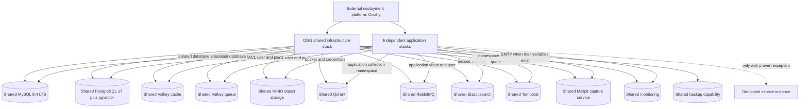

# OGG Infrastructure Stack

This document defines the production backing-service platform for the applications in `REPOSITORIES.md`. Coolify deploys the shared services and application containers.

Coolify itself is outside scope. Its control plane, internal PostgreSQL/Redis, Traefik proxy, Sentinel, and internal management network are not part of the OGG stack and must not be modified by this project.

## Core Shared Services and Capabilities

The following capabilities are reused by multiple compatible applications. Sharing means one managed capability or server process with isolated application credentials and data; it never means one shared application database, schema, bucket, or password.

| Shared capability | Technology | Current consumers | Purpose | Isolation |
| --- | --- | --- | --- | --- |
| `mysql` | MySQL 8.4 LTS | Lokei, Albert, Record Cloud, Insight, Kensi AI, AgentsHQ, Togglebox MySQL edition, OpenPay, OpenKudos | Primary relational database for applications currently built for MySQL | One database and restricted user per application |
| `postgres` | PostgreSQL 17 plus pgvector | Plane, Postiz, Nudgra, n8n, Twenty, Buzz, SocialReply, QM, Postiz Temporal | Primary relational database only for applications that already use PostgreSQL | One database, `NOSUPERUSER` role, schema ownership, and connection limit per application; extensions enabled per database |
| `valkey` | Valkey 8 | Plane | Plane's existing Valkey-compatible cache contract and future verified Valkey consumers | Dedicated ACL user; disposable cache policy |
| `redis-cache` | Redis 7.2 | Twenty; Postiz cache when classified; OpenPay optional | Disposable cache, sessions, rate limits, and short-lived locks for Redis-bound applications | One ACL user per application; key prefixes where supported |
| `redis-queue` | Redis 7.2 | Lokei, Albert, Kensi AI, OpenKudos, n8n, Postiz, Buzz, SocialReply; OpenPay optional | Durable queues, Horizon/BullMQ jobs, retries, pub/sub, presence, and workflow state | One ACL user per application; AOF `everysec`, `noeviction` |
| `minio` | Shared MinIO S3-compatible object storage | Record Cloud, Plane, Buzz, SocialReply; Kensi AI, OpenPay, and Twenty when S3 storage is enabled; future S3-compatible consumers | Uploads, recordings, attachments, and application objects | One bucket, service account, and least-privilege bucket policy per application |
| `qdrant` | Qdrant | Albert | Vector search for Albert and future applications | Separate collection namespace, ownership record, resource budget, snapshots, and restore test per application |
| `rabbitmq` | RabbitMQ | Plane | Durable message brokering for Plane and future applications | Separate vhost, user, permissions, policies, quotas, and monitoring per application |
| `elasticsearch` | Elasticsearch | Postiz Temporal | Search and indexing for Postiz/Temporal and future applications | Separate index/alias prefix, role or API key, ILM policy, resource budget, and snapshot scope per application |
| `temporal` | Temporal | Postiz | Durable workflow orchestration for Postiz and future applications | Separate namespace, retention policy, search attributes, worker task queues, and visibility scope per application |
| `mailpit` | Mailpit `v1.30.0` | Record Cloud, OpenPay, Twenty, SocialReply, and every further deployment whose environment or Compose exposes SMTP/mail transport settings | Shared capture and inspection of application-generated email without external delivery | Private shared-network SMTP endpoint; authenticated/private UI; bounded persistent message store; no outbound relay |
| `monitoring` | Monitoring and alerting platform | All production services and applications | Health, capacity, queue, worker, backup, and certificate monitoring | Application/service labels, dashboards, alert routes, and ownership |
| `backup` | Scheduled off-server backup capability | Every stateful production service | Database dumps/snapshots, object-storage protection, Qdrant/Elasticsearch snapshots, and restore testing | Separate retention, encryption, restore procedure, and evidence per application/service |

The selected common database baselines are **PostgreSQL 17 plus pgvector** and **MySQL 8.4 LTS**. Every application receives its own database and role. Application schema migrations still run within that isolated database, and backup/restore testing begins after initialized production data exists.

## Shared MinIO Object Storage

The object-storage implementation is **one shared MinIO deployment** managed by Coolify. External S3-compatible storage is not an alternative application backend in this phase.

- Every consuming application receives a dedicated bucket; applications never share buckets or object prefixes as their primary isolation boundary.
- Every application receives a dedicated MinIO service account and a policy restricted to its bucket and required operations.
- The S3 API is available only through the shared application network unless a specific application proves that a public endpoint is required for direct client uploads.
- The MinIO administration console is restricted to trusted operators and is not a public application service.
- Record Cloud, Plane, Buzz, and SocialReply are required consumers.
- Kensi AI, OpenPay, and Twenty use the same MinIO service when their existing S3 storage mode is enabled.
- Future applications with an S3-compatible storage contract use this shared MinIO service by default.
- MinIO data is stateful and must be included in the off-server backup and restore-test design; storing the only backup inside the same MinIO deployment is not a backup.

Application configuration uses the MinIO S3 endpoint plus application-specific access key, secret key, bucket, region placeholder, and path-style addressing when required by the application's S3 client. Exact environment-variable names remain application-specific.

## Shared PostgreSQL 17 Compatibility

PostgreSQL 17 is the common major for the shared PostgreSQL service. The pgvector image supplies the standard server plus vector support for SocialReply without requiring a second PostgreSQL process. The source audit found no PostgreSQL 16-only dependency in n8n, Twenty, or Postiz Temporal and no PostgreSQL 15-only dependency in Plane. Extensions are enabled only inside the databases that require them.

| Consumer | Current repository/recipe baseline | PostgreSQL 17 decision | Required acceptance gate |
| --- | --- | --- | --- |
| Plane | PostgreSQL 15.7 | Compatible target for its isolated PostgreSQL 17 database | Validate API, web, workers, RabbitMQ integration, and backup/restore |
| Postiz application | PostgreSQL 17; Prisma with the standard PostgreSQL provider | Direct major match | Validate migrations, publishing flows, workers, and backup/restore |
| Postiz Temporal | PostgreSQL 16 with Temporal's `postgres12` compatibility plugin | Compatible target | Validate both Temporal persistence databases and workflow execution |
| Nudgra OSS | PostgreSQL 17; Drizzle, `pg`, `pg-boss`, and `pgcrypto` | Direct major match | Validate authentication, CRUD, realtime paths, `pg-boss`, and backup/restore |
| n8n | PostgreSQL 16 | Compatible target | Validate editor, webhook, queue execution, retries, workers, and backup/restore |
| Twenty | PostgreSQL 16 | Compatible target | Validate app, worker, `pg-boss`, and backup/restore |
| Buzz | PostgreSQL 17 in the official VPS Compose; SQLx migrations with `pgcrypto` | Direct major match | Validate relay events, search, membership, media, git, and backup/restore |
| SocialReply | PostgreSQL 17 plus pgvector | Direct major and extension match | Validate migrations, vector queries, Horizon, Reverb, and backup/restore |
| QM | Standard PostgreSQL through `pg` and durable Postgres stores | Compatible target | Validate startup migrations, sessions, runs, grants, artifacts, and backup/restore |

One PostgreSQL 17 server process does not mean one shared schema. Each application receives its own database and non-superuser owner role. Temporal receives its required persistence databases and roles separately from the Postiz application database. Extensions are enabled only in the database that needs them.

The migrated shared PostgreSQL 17 data volume remains the durable server volume. Adding QM creates only a new `qm` role and database; it does not recreate the server or modify another application's database.

## PostgreSQL Extension Isolation

The shared PostgreSQL image contains pgvector, but `CREATE EXTENSION vector` is
run only inside SocialReply's database. Nudgra and Buzz receive `pgcrypto` only
inside their own databases. QM requires no additional extension. Database and
role isolation remains the primary boundary for every consumer.

## Shared MySQL 8.4 LTS Compatibility

MySQL 8.4 LTS is the common major for the shared MySQL service. Record Cloud and Kensi AI already use 8.4. The remaining inspected applications use MySQL 8.0/8.x clients and schema features supported by 8.4; no application migration requiring an older-only MySQL feature was found. The Laravel applications remain MySQL applications and require configuration changes, not a PostgreSQL port.

| Consumer | Current repository/recipe baseline | MySQL 8.4 decision | Required acceptance gate |
| --- | --- | --- | --- |
| Lokei | MySQL 8.0; Laravel 13; generated-column migrations | Compatible target; generated columns remain supported | Run migrations from empty and validate web, Horizon, scheduler, indexes, generated-column queries, and initialized-data backup/restore |
| Albert | MySQL 8.0.36; Laravel 13 with `pdo_mysql` | Compatible target | Run migrations from empty and validate web, Horizon, scheduler, Reverb, Qdrant workflows, and initialized-data backup/restore |
| Record Cloud | MySQL 8.4; Drizzle and `mysql2` 3.x | Direct match | Validate fresh migrations, recording metadata, object-storage references, and initialized-data backup/restore |
| Insight / Clavinci | MySQL 8.0.46 in production; MySQL 8.4.6 client in backup jobs; Drizzle and `mysql2` 3.x | Compatible target; the existing tooling already includes an 8.4 client | Validate fresh migrations, `utf8mb4_0900_ai_ci`, locks, TLS settings, production queries, and initialized-data backup/restore |
| Kensi AI | MySQL 8.4; Laravel 12 with `pdo_mysql` | Direct match | Validate fresh migrations, web/API, worker, scheduler, and initialized-data backup/restore |
| AgentsHQ | MySQL 8.x; Drizzle and `mysql2` 3.x | Compatible target | Run migrations from empty and validate API queries, transactions, and initialized-data backup/restore |
| Togglebox MySQL edition | Prisma 5.7 with the MySQL provider; exact MySQL-compatible ref still must be pinned | Conditional compatibility target; the engine choice is correct but the deployable ref is unresolved | Pin the MySQL edition, run its complete schema/migration suite on 8.4, and smoke-test application behavior before admitting it to shared MySQL |
| OpenPay | MySQL 8.0; Laravel 12 with `pdo_mysql` | Compatible target | Run migrations from empty and validate API/web, database queues or Horizon as configured, scheduler, payments, and backup/restore |
| OpenKudos / TeamToast | MySQL 8.0.40; Laravel 12 with `pdo_mysql` | Compatible target | Run migrations from empty and validate API/web, worker, scheduler, and initialized-data backup/restore |

Each application receives a separate database and restricted user. Database character set and collation are declared per application rather than silently inherited from a server default. New credentials use MySQL 8's default authentication unless a real client test proves that an exception is necessary; legacy authentication is not enabled globally.

No repository recipe's MySQL data volume is reused. The shared MySQL 8.4 service initializes a new volume, and each application initializes a new isolated database through its pinned schema migrations.

## Shared Mailpit Service

The stack runs **one shared Mailpit container** as the SMTP target for every application that already exposes SMTP or mail-transport settings in its environment contract or Docker Compose file. Mailpit captures messages for inspection and does not deliver them to external recipients.

This is deliberately not a production email-delivery platform. It needs no sending-domain verification, SPF, DKIM, DMARC, reputation management, or external SMTP credentials. When external delivery is required later, each affected application changes its SMTP environment values to the selected provider; application mail code does not need to change.

### Automatic consumer rule

Mailpit is mandatory when a deployment's resolved production environment template or Compose configuration contains SMTP/mail transport variables such as:

- `MAIL_MAILER`, `MAIL_HOST`, `MAIL_PORT`, `MAIL_USERNAME`, or `MAIL_PASSWORD`;
- `SMTP_HOST`, `SMTP_PORT`, `SMTP_USER`, or `SMTP_PASSWORD`;
- `EMAIL_DRIVER`, `EMAIL_HOST`, `EMAIL_PORT`, or `EMAIL_SMTP_*`.

The deployment audit records the exact variable mapping. A platform does not need a separate architectural decision once the variables are found: it becomes a Mailpit consumer automatically.

Current repository/recipe evidence:

| Deployment unit | Evidence | Mailpit decision |
| --- | --- | --- |
| Record Cloud | Repository `.env.example` explicitly defines Mailpit SMTP and sender settings | Required |
| OpenPay | API `.env.example` defines Laravel mail transport host, port, username, password, and sender settings | Required; change the mailer from `log` to `smtp` for the deployed environment |
| Twenty | Current Coolify recipe exposes `EMAIL_DRIVER`, `EMAIL_SMTP_HOST`, `EMAIL_SMTP_PORT`, `EMAIL_SMTP_USER`, and `EMAIL_SMTP_PASSWORD` | Required; set `EMAIL_DRIVER=smtp` |
| SocialReply | Root and API env contracts define Laravel SMTP transport; API, Horizon, and scheduler send mail | Required; target shared `mailpit:1025` until an external delivery provider is selected |
| Any additional application | SMTP/mail variables discovered in its resolved environment or Compose during deployment preparation | Required automatically |

### Deployment shape

- Image: `axllent/mailpit:v1.30.0`, with the deployed image digest recorded and pinned.
- SMTP: internal shared-network endpoint `mailpit:1025`; never publish port `1025` on the host or through Traefik.
- UI/API: port `8025`; expose only through authenticated access or a private operator path because captured messages may contain login links, invitations, personal data, and reset tokens.
- Storage: persistent SQLite volume at `/data/mailpit.db` with a bounded message count and scheduled pruning.
- Relaying and forwarding: disabled. Mailpit must not be configured with an upstream SMTP relay in this phase.
- Isolation: this is intentionally one shared operational inbox, not a tenant security boundary. Access is restricted to trusted operators.

The container receives conservative CPU and memory limits during implementation and is load-tested with the selected message-size and retention limits before those limits are finalized. Mailpit is a single static binary with no database or queue dependency.

### Application configuration contract

Laravel and applications using equivalent SMTP variables receive:

```dotenv
MAIL_MAILER=smtp
MAIL_HOST=mailpit
MAIL_PORT=1025
MAIL_USERNAME=null
MAIL_PASSWORD=null
MAIL_ENCRYPTION=null
MAIL_FROM_ADDRESS=<application-specific placeholder sender>
MAIL_FROM_NAME=<product display name>
```

Twenty receives the equivalent framework-specific mapping:

```dotenv
EMAIL_DRIVER=smtp
EMAIL_SMTP_HOST=mailpit
EMAIL_SMTP_PORT=1025
EMAIL_SMTP_USER=
EMAIL_SMTP_PASSWORD=
EMAIL_FROM_ADDRESS=<application-specific placeholder sender>
EMAIL_FROM_NAME=<product display name>
```

No DNS authentication work is performed for placeholder sender addresses because Mailpit does not transmit messages onto the public email system.

### Acceptance gate

For every detected consumer:

1. The mail-sending web, worker, and scheduler processes resolve `mailpit` on the shared network.
2. A generated application email appears in the Mailpit UI with the correct deployment unit, subject, recipient, and content.
3. No application SMTP port and no Mailpit SMTP port is publicly reachable.
4. Mailpit persists messages across a container recreation and removes messages according to the configured retention bound.
5. A delivery attempt cannot reach an external recipient because relay and forwarding are disabled.

## Redis and Valkey Consumers

The portfolio runs both technologies: Valkey for Plane, whose official stack already uses it, and Redis 7.2 for applications whose current recipes explicitly use Redis. Redis cache and durable queues remain separate because their eviction and recovery requirements conflict.

| Application | Cache backend | Queue backend | Direct evidence / decision |
| --- | --- | --- | --- |
| Lokei | Redis queue service | Redis queue service | Its Laravel config exposes one Redis endpoint and runs Horizon; durable policy protects jobs |
| Albert | Redis queue service | Redis queue service | Its Laravel config exposes one Redis endpoint and runs Horizon |
| Kensi AI | Redis queue service | Redis queue service | Its Laravel config exposes one Redis endpoint plus worker and scheduler |
| OpenKudos / TeamToast | Redis queue service | Redis queue service | Its Laravel production stack runs worker and scheduler against Redis |
| Plane | Valkey | RabbitMQ | Plane's official stack already uses Valkey and RabbitMQ |
| Postiz | Redis queue service | Redis queue service | Its pinned fork uses Redis 7.2 with AOF, so the durable policy is preserved |
| Buzz | Redis queue service | Redis pub/sub and short-lived coordination | Upstream's production bundle enables AOF; all inspected keys and channels use the `buzz:*` prefix, allowing a restricted ACL user |
| SocialReply | Redis queue service | Redis queue service; Horizon and Reverb pub/sub | Laravel supports an ACL username and explicit Redis/cache/Horizon/Reverb prefixes; the recipe restricts keys and channels to `social-reply:*` |
| n8n | No | Redis queue service | Queue mode points BullMQ at Redis |
| Twenty | Redis cache service | PostgreSQL `pg-boss` | Its recipe uses Redis for cache and PostgreSQL for jobs |
| OpenPay | Database by default | Database by default | Redis remains available if Horizon/Redis modes are enabled later |
| Record Cloud | No | No | No Redis dependency in pinned Compose |
| Insight / Clavinci | No | No | No Redis dependency in pinned production Compose |
| AgentsHQ | No | No | No Redis dependency in pinned API Compose |
| Togglebox | Pending | Pending | Inspect and pin the MySQL-compatible version first |
| Ploon | No | No | Stateless web deployment |
| Open Growth Group website | No | No | Stateless website deployment |
| Nudgra OSS | No | No | No Redis dependency in pinned Compose |

Because this is greenfield, every cache and queue starts empty; no Redis or Valkey persistence is migrated. Production acceptance still requires cache, enqueue/consume/retry, ACL, and queue-liveness checks.

The inspected Laravel applications expose one Redis host/username/password tuple for both the default and cache connections, so their generated recipes place both workloads on durable `redis-queue`. Plane uses Valkey. Twenty uses `redis-cache`. Postiz uses `redis-queue` because its current Redis recipe enables AOF. SocialReply also uses `redis-queue`, with explicit `social-reply:*` key/channel prefixes for its ACL boundary.

## Shared Durable Execution Services

The stack provides multiple shared durable-execution technologies because applications use different protocols and semantics. They are reusable portfolio capabilities; none belongs to its first consumer.

| Shared service | Workload type | Current consumers | Future-consumer isolation |
| --- | --- | --- | --- |
| `temporal` | Long-running durable workflows, retries, timers, and workflow state | Postiz is the first consumer | Namespace, task queues, retention, search attributes, worker identity, and monitoring per application |
| `rabbitmq` | AMQP message queues and event delivery | Plane is the first consumer | Vhost, user, permissions, policies, quotas, dead-letter configuration, and monitoring per application |
| `redis-queue` | Redis queues, pub/sub, and coordination such as Laravel Horizon, BullMQ, n8n queue mode, Buzz presence/events, and SocialReply realtime | Lokei, Albert, Kensi AI, OpenKudos, n8n, Postiz, Buzz, SocialReply | ACL user, key/channel prefix where supported, queue names, persistence budget, and monitoring per application |
| Shared PostgreSQL | Database-backed job queues | Twenty uses `pg-boss`; OpenPay currently defaults to database queues | Separate application database/role; job tables remain inside the application's database |

Future software selects the shared service matching its native, supported queue/workflow backend. Existing applications are not rewritten from one durable-execution technology to another merely to standardize the stack.

## Shared-by-Default Policy

Any backing technology that can safely serve more than one application is deployed as a reusable shared capability, even when the portfolio currently has only one consumer.

An application receives a dedicated instance only when direct evidence proves one of these exceptions:

- It requires an incompatible engine or major version.
- The technology lacks a safe tenant boundary for the required operations.
- Its resource profile can starve other applications and cannot be bounded safely.
- Its security, compliance, availability, or upgrade requirements create an unacceptable shared failure domain.
- A fresh initialization cannot satisfy isolation, resource, backup, restore, or recovery gates.

A dedicated exception must name the evidence, owner, cost, and conditions required to reconsider sharing. It is not the default architecture.

## Application Dependency Matrix

Statuses:

- **Shared**: target the corresponding core shared service after compatibility validation.
- **Dedicated**: keep an application-scoped service.
- **None**: the deployment unit does not require that service.
- **Pending**: direct source or runtime evidence is incomplete.

| Deployment unit | Relational database | Cache | Durable queue/workflow | Object storage | Search/vector/messaging | Source-grounded decision |
| --- | --- | --- | --- | --- | --- | --- |
| Lokei | Shared MySQL | Shared Valkey | Shared Valkey; Laravel Horizon | None observed | None observed | Pinned Compose uses MySQL 8.0, Redis 7, Horizon, and scheduler |
| Albert | Shared MySQL | Shared Valkey | Shared Valkey; Laravel Horizon | Pending | Shared Qdrant; Laravel Reverb remains an app process | Pinned Compose uses MySQL 8.0.36, Redis 7.2, Qdrant 1.12.1, worker, scheduler, and Reverb |
| Record Cloud | Shared MySQL | None observed | None observed | Shared object storage | None observed | Pinned Compose uses MySQL 8.4 and MinIO; its SMTP settings target the shared Mailpit service, while Stripe CLI remains development-only and must not ship to production |
| Insight / Clavinci | Shared MySQL | None observed | None observed | Backup destination required | None observed | Pinned production Compose uses digest-pinned MySQL 8.0.46 and dedicated backup/restore jobs |
| Kensi AI | Shared MySQL | Shared Valkey | Shared Valkey; Laravel worker | Shared object storage when S3 disk is enabled | None observed | Pinned API Compose uses MySQL 8.4, Redis 7, worker, and scheduler; web is stateless |
| AgentsHQ | Shared MySQL | None observed | None observed | None observed | None observed | Pinned API Compose uses MySQL 8; web is stateless |
| Togglebox | Shared MySQL | Pending inspection of MySQL-compatible ref | Pending inspection of MySQL-compatible ref | Pending inspection of MySQL-compatible ref | None selected | Use the MySQL-compatible Togglebox version. The currently inspected DynamoDB commit is rejected for production; identify and pin the exact MySQL-compatible ref before building |
| Ploon | None | None | None | None | None | Stateless web deployment; API dependency remains Pending if configured externally |
| Open Growth Group website | None | None | None | None | None | Stateless website |
| OpenPay | Shared MySQL | Database cache by current defaults; Shared Valkey is available | Database queue by current defaults; Horizon requires Redis/Valkey when enabled | Shared object storage when S3 is enabled | None selected; DynamoDB configuration remains disabled | Pinned Compose includes MySQL, Redis, Horizon, and phpMyAdmin; phpMyAdmin must not ship publicly and DynamoDB is out of scope |
| OpenKudos / TeamToast | Shared MySQL | Shared Valkey | Shared Valkey; worker and scheduler | Pending | None observed | Pinned production Compose uses MySQL 8.0.40 and Redis 7.4 |
| Plane | Shared PostgreSQL 17 | Shared Valkey | Shared RabbitMQ | Shared object storage after bucket-policy validation | Shared RabbitMQ | Isolated database and role |
| Postiz | Shared PostgreSQL 17 | Shared Valkey | Shared Temporal using a Postiz namespace and isolated task queues | Fresh uploads storage; S3 support Pending | Shared Elasticsearch using isolated indices/role | Isolated application and Temporal databases |
| Nudgra OSS | Shared PostgreSQL 17 with `pgcrypto` | None observed | PostgreSQL `pg-boss` inside Nudgra's isolated database | None observed | None observed | Isolated database and role |
| n8n | Shared PostgreSQL 17 | None | Shared Valkey queue; n8n worker and external runners | Fresh local n8n volume; external binary storage Pending | None observed | Isolated database and role |
| Twenty | Shared PostgreSQL 17 | Shared Redis cache | PostgreSQL `pg-boss`; no Redis queue required by current recipe | Shared object storage when S3 mode is enabled | None observed | Isolated database and role |
| Buzz | Shared PostgreSQL 17 with `pgcrypto` | Shared durable Redis | Redis pub/sub | Shared object storage with isolated `buzz-media` bucket | None observed | Isolated database and role |
| SocialReply | Shared PostgreSQL 17 with pgvector | Shared durable Redis | Shared Redis; Horizon and Reverb remain application processes | Shared object storage with isolated `social-reply` bucket | pgvector only in its isolated database | Isolated database and role |
| QM | Shared PostgreSQL 17 through a pinned TCP proxy | None | Dedicated private Docker-in-Docker agent sandbox | Persistent QM and nested-Docker volumes | Claude subscription harness | Only the proxy joins the shared network; the privileged DinD service never mounts the host Docker socket |

## Database Engine Preservation Policy

Database engines are fixed by the application's current implementation:

- MySQL applications remain on MySQL.
- PostgreSQL applications remain on PostgreSQL.
- No task may convert a Laravel/MySQL application to PostgreSQL.
- No task may convert a PostgreSQL application to MySQL.
- Sharing consolidates compatible applications onto an engine-matched server; it never changes the engine.
- Every fresh database still requires application compatibility checks, schema-migration evidence, isolation tests, and backup/restore evidence after initialization.

Current engine groups:

| Engine | Applications |
| --- | --- |
| PostgreSQL 17 plus pgvector | Plane, Postiz, Nudgra OSS, n8n, Twenty, Buzz, SocialReply, QM, plus Postiz's Temporal databases |
| MySQL 8.4 LTS target | Lokei, Albert, Record Cloud, Insight/Clavinci, Kensi AI, AgentsHQ, Togglebox MySQL edition, OpenPay, OpenKudos/TeamToast |
| No application database observed | Ploon and Open Growth Group website |

## Deployment Boundaries



Coolify deploys both the shared stack and application stacks. Cross-stack connections use the Coolify-supported shared network mechanism, but that network is integration plumbing and is not itself an OGG service.

## Isolation Rules

- Unique database, user/role, password, ownership, connection limit, and extension set per application.
- Unique Valkey ACL username, password, key prefix, channel prefix, and denied administrative/destructive commands per application.
- Unique MinIO bucket, service account, and least-privilege bucket policy per application.
- Separate Qdrant collection names, ownership records, resource budgets, snapshots, and restore evidence per consuming application.
- Separate RabbitMQ vhosts, users, permissions, policies, quotas, and queue monitoring per consuming application.
- Separate Elasticsearch index/alias prefixes, roles or API keys, ILM policies, budgets, and snapshot evidence per consuming application.
- Separate Temporal namespaces, retention policies, task queues, search attributes, and worker monitoring per consuming application.
- Shared Mailpit has no application-level security boundary; restrict UI access to trusted operators, keep SMTP internal-only, bound retention, and disable relay/forwarding.
- No public database, Valkey, Elasticsearch, RabbitMQ, Qdrant, object-storage administration, or Mailpit SMTP ports.

Valkey logical database numbers are organization only, not security boundaries.

## Greenfield Initialization Rule

There is no application-data migration or legacy datastore cutover. A new application is admitted to production only after all of the following pass:

1. The application receives a fresh isolated database, role/user, credentials, and required extensions or engine settings.
2. Its pinned schema migrations complete from an empty database and a second migration run is idempotent.
3. Web health, workers, queues, object storage, shared-service isolation, and negative cross-tenant access tests pass.
4. The application creates bounded sentinel data through its supported interface.
5. An off-server backup captures the initialized state and restores into a temporary isolated target.
6. The restored sentinel data is queryable and the recovery evidence records duration, ownership, and failure alerts.
